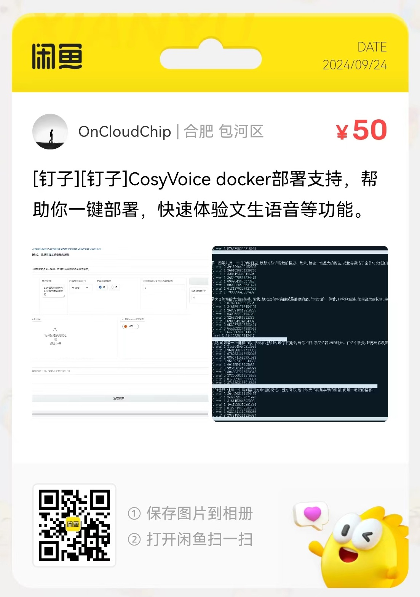

## 功能说明
* 支持fastgpt 语音合成流式播放结合cosyvoice
  
## 文件说明
### app.py
放在 /workspace/CosyVoice/
容器内部 启动服务 python /workspace/CosyVoice/app.py

### cosyvoice.py
放在 /workspace/CosyVoice/cosyvoice/cli/目录

## 配置说明
1. 配置文件在configs/config.json

```
{
    "prompt_text": "长乐的简单与和静  在这里体现的淋漓尽致",   // 音频文件内容
    "prompt_speech": "wav_2707520_2870400.wav"              // 音频文件名称
}
```

## 技术支持
