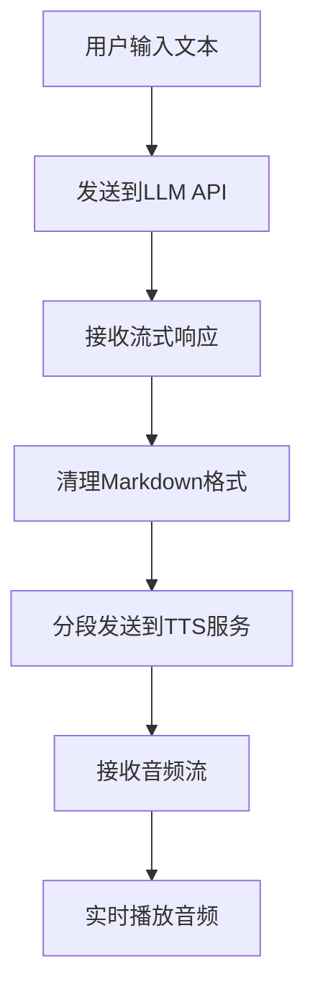
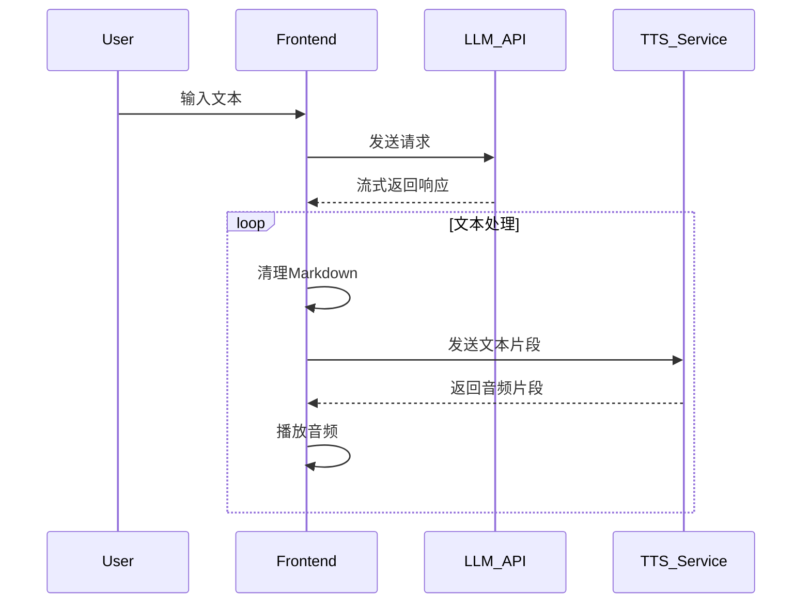

# TTS Vue Demo

基于Vue 3的流式文本转语音(TTS)演示项目，集成PaddleSpeech TTS服务，实现文本流式输入和语音流式播放功能。

## 功能特性

- 流式文本处理：支持长文本分段处理
- 流式音频播放：音频数据实时接收并播放
- 自动重连：WebSocket连接异常自动恢复
- 状态管理：实时显示处理状态
- Markdown清理：自动清理LLM返回的Markdown格式

## 技术架构



## 流式处理时序



## 核心代码说明

### WebSocket连接管理
```typescript
class PaddleSpeechTTSClient {
  private socket: WebSocket | null = null
  private sessionId: string | null = null
  private audioQueue: AudioBuffer[] = []
  // ...
}
```

### 音频流处理
```typescript
private async playNext() {
  if (this.isPlaying || this.audioQueue.length === 0) return
  
  this.isPlaying = true
  const nextAudio = this.audioQueue.shift()
  // 播放音频逻辑
}
```

### Markdown清理
```typescript
async function cleanMarkdown(content: string) {
  // 清理各种Markdown标记
  return cleanedContent
}
```

## 使用说明

1. 安装依赖
```bash
npm install
```

2. 启动开发服务器
```bash
npm run dev
```

3. 在文本框中输入内容，点击"Generate Speech"按钮

## 配置项

| 环境变量 | 说明 | 默认值 |
|---------|------|-------|
| VITE_TTS_ENDPOINT | TTS服务地址 | `/api/paddlespeech` |
| VITE_LLM_ENDPOINT | LLM API地址 | `/api/conversation` |

## 开发指南

1. 克隆仓库
2. 安装依赖
3. 配置环境变量
4. 启动开发服务器

## 依赖项

- Vue 3
- TypeScript
- Vite
- WebSocket API
- Web Audio API
